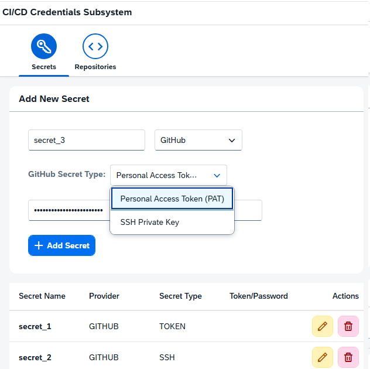
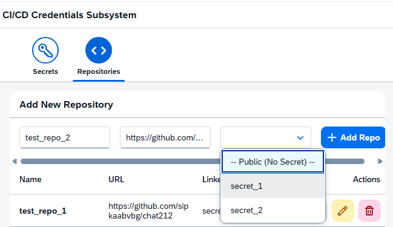

# CI/CD Repository Credential Service

## Overview
This project is a subsystem of a CI/CD platform. It provides a web service and a graphical user interface (GUI) designed to securely manage repository URLs and the secrets required for authenticating against them. 

## Features
### Secrets Management Dashboard (SAPUI5 UI Preview)
The "Secrets" tab provides a centralized configuration panel where users can securely manage sensitive credentials before linking them to code repositories.
* **Dynamic Secret Type Selection:** The form supports granular authentication methods depending on the Selected Provider. For GitHub, users can choose between standard **Personal Access Token (PAT)** or plan ahead for **SSH Private Key** deployment.
* **Input Masking & Privacy:** The credential input field (Token/Password) is fully masked by default to protect sensitive keys from over-the-shoulder viewing during data entry.
* **Persisted Credentials Inventory:** The responsive table at the bottom tracks all encrypted secrets currently stored in the database. It provides an at-a-glance overview of the Secret Name, Provider, and Token Type, along with immediate management actions.
* **Inline Operations (Actions):** Each secret row features intuitive controls for editing existing configurations or triggering a safe deletion flow.
* **Inline Operations (Actions) & Integrity Protection:** Each secret row features intuitive controls for editing configurations or triggering a deletion flow. To ensure strict data integrity, the Spring Boot backend performs a validation check prior to removal; **a secret cannot be deleted if it is actively linked to a repository**. If a user attempts to delete a bound secret, the system rejects the operation and displays a graceful validation message.


### Repositories Management Dashboard (SAPUI5 UI Preview)

The "Repositories" tab handles the registration and tracking of external source code repositories, mapping them dynamically to the predefined secrets when required.
* **Dynamic Secret Association (Nullable Relation):** The dropdown menu highlights the application's ability to handle both private and open-source workflows. Users can explicitly select an existing credential profile (`secret_1`, `secret_2`) or choose **`-- Public (No Secret) --`**. Choosing the public option transparently passes a null payload to the JPA layer, saving a `NULL` foreign key in the database.
* **Granular Repository Attributes:** The registration form accepts user-defined local alias names along with the absolute VCS target URL (e.g., GitHub HTTPS repository links).
* **Consolidated Data Grid:** The table at the bottom serves as an inventory list, displaying active repositories, their remote locations, and the specific secret key names they are bound to.
* **Lifecycle Controls:** Features built-in action hooks for triggering update procedures or complete removal cascades directly via the user interface.



## Tech Stack
- **Backend:** Java 25, Spring Boot 4, Spring Data JPA, H2 Database (In-Memory)
- **Frontend:** JavaScript, SAPUI5, Node.js
- **Containerization:** Docker & Docker Compose
- **Build Tool:** Maven

## Security Architecture & Data Privacy
In a production-ready CI/CD system, secrets must never be stored in plain text. In this project, **Personal Access Tokens (PAT) are stored symmetrically encrypted** in the database using the Advanced Encryption Standard (AES). 

This is implemented transparently via a JPA `AttributeConverter`. The application logic operates with plain objects, while data at rest remains secure against unauthorized database access. 
*(Note: For the scope of this exercise, the AES encryption key is hardcoded. In a real environment, it should be fetched from a secure vault or environment variable).*

In addition, standard sequential IDs have been replaced with **UUIDs** to prevent Insecure Direct Object Reference (IDOR) vulnerabilities.

## Current Provider Support & Limitations
Currently, the system exclusively supports **GitHub** integration.
Authentication is implemented using **Personal Access Tokens (PAT)**, which are the standard mechanism for secure Git operations over HTTPS, replacing deprecated password-based authentication.
Repository credential validation is implemented via the GitHub REST API, ensuring secure verification of access rights. The design is extensible and allows future support for SSH-based authentication and validation mechanisms.

# Architecture

## Backend Architecture & Layered Design

The backend is built following a strict **Layered Architecture (Three-Tier Architecture)** pattern.  While currently running as a decoupled backend component, the design follows cloud-native principles, making it fully ready to operate as an independent **Microservice** within a larger CI/CD ecosystem.

The application logic is structured into four distinct, isolated layers:

```text
[ Client / UI (SAPUI5) ]
           │
           ▼
[ 1. Presentation Layer ]  (REST Controllers — handles DTOs & HTTP Validation)
           │
           ▼
[ 2. Service Layer ]       (Business Logic — coordinates transactions & Strategies)
           │
           ▼
[ 3. Data Access Layer ]   (Spring Data JPA — abstracts DB queries)
           │
           ▼
[ 4. Database Layer ]      (H2 In-Memory — stores encrypted data at rest)


### Architectural Layers Explained

1. **Presentation Layer (Controllers):**
   * **Role:** Exposes the REST API endpoints to the SAPUI5 frontend and external consumers.

2. **Service Layer (Business Logic):**
   * **Role:** The core engine of the system where business rules are enforced.

3. **Data Access Layer (Repositories):**
   * **Role:** Manages communication with the database.

4. **Database Layer (Data Store):**
   * **Role:** Persistent (or in-memory) storage.
  
## Database Relations 
- **Many-to-One (Repositories ➔ Secrets):** The system uses a `@ManyToOne` Hibernate relationship. This allows authentication credentials to be centralized and shared across different repository tracks.
- **Optional Secret (Nullable Foreign Key):** If a repository is **Public**, the user can save it without choosing a credential from the dropdown menu. In this case, the frontend sends a `null` payload, and the database stores a `NULL` value in the `secret_id` column. The UI automatically displays these entries as `No Secret (Public)`.

## Architectural Design Patterns

### Extensibility via Strategy Pattern
To support seamless future expansion to other source code management providers (like GitLab or Bitbucket) and alternative authentication methods (like SSH Keys), the validation engine is decoupled using the **Strategy Design Pattern**.

At the core of this architecture is the `CredentialValidator` interface:

* **Dynamic Capability Discovery (`supports`):** Every validator implementation defines which provider (e.g., GitHub, GitLab) and which authentication method (e.g., TOKEN, SSH) it can handle by implementing the `supports(String provider, String authMethod)` method.
* **Encapsulated Execution (`validate`):** The core business logic interacts strictly with the high-level `CredentialValidator` abstraction, completely unaware of the underlying API specifics or HTTP endpoints of the remote providers.

#### How Spring Boot Resolves Strategies Automatically:
The system leverages Spring’s dependency injection to inject a `List<CredentialValidator>` into the validation service. When a request arrives, the service dynamically detects and executes the correct validator at runtime:

```java
ublic ValidationResponse validate(
         String repoUrl,
         UUID credentialId) {
     log.info("Starting validation logic for repository: {} using credential ID: {}", repoUrl, credentialId);
     SecretEntity secret = secretRepository.findById(credentialId)
             .orElseThrow(() -> new RuntimeException("Secret not found"));
     // Find matching strategy at runtime
     CredentialValidator validator = validators.stream()
             .filter(v -> v.supports(
                     secret.getProvider(),
                     secret.getSecretType()
             ))
             .findFirst()
             .orElseThrow(() ->
                     new RuntimeException("No validator found")
             );
     // Delegate validation to selected strategy
     return validator.validate(repoUrl, secret.getSecretValue());
```
This open-closed architecture guarantees that adding support for GitLab Token Validation or Bitbucket SSH Validation requires zero modifications to existing services—you simply drop in a new @Component implementing CredentialValidator.

## Getting Started & Installation

## Prerequisites
To run this project locally, you need to have the following installed:
- **Java 25** (or compatible JDK)
- **Maven** (or you can use the included Maven wrapper `./mvnw`)
- **Node.js** (v18 or higher) & **npm** (for the SAPUI5 frontend)
- **Docker** (Docker and Docker Compose installed on your machine)


### Option 1: Using Docker (Recommended)
You can run the entire stack (Frontend + Backend) using Docker Compose.

- Clone the repository:
   ```bash
   git clone https://github.com/sipkaabvbg/repository-secret-manager.git
   cd repository-secret-manager
   ```
Build and start the containers:

Run the following command in the console to build and start the containers:


docker-compose up --build

- Access the application:
Frontend (UI5): http://localhost:8080/index.html
Backend API: http://localhost:8081/api/v1/swagger-ui/index.html#/


### Option 2: Running Locally (Manual Setup)
### Start the Backend (Spring Boot)
Ensure you have Java 25 and Maven installed.
- The backend runs on http://localhost:8081. The H2 database is in-memory and will initialize automatically.
- Navigate to the backend directory:

cd repository-secret-service

- Run the application using the Maven Wrapper (no local Maven installation required!):
- For Mac/Linux:

 ./mvnw spring-boot:run

- For Windows:

 mvnw.cmd spring-boot:run

- (Optional) You can access the H2 database console at http://localhost:8081/h2-console.
### Start the Frontend (SAPUI5)
Ensure you have Node.js installed.
- The frontend uses UI5 Tooling and runs on a local development server.
- Open a new terminal and navigate to the repository-secret-ui directory:

cd repository-secret-ui

- Install the required dependencies:

npm install

- Start the UI5 development server:

npm start

- The application should automatically open in your default browser (usually at http://localhost:8080/index.html or a proxy port like 8081).

## API Endpoints Summary

### Repositories API
- GET `/api/v1/repositories` - Fetch all repositories
- POST `/api/v1/repositories` - Add a new repository
- DELETE `/api/v1/repositories/{id}` - Delete a repository
### Secrets API
- GET `/api/v1/secrets` - Fetch all secrets
- POST `/api/v1/secrets` - Add a new secret
- DELETE `/api/v1/secrets/{id}` - Delete a secret
### Validation API
- POST `/api/v1/validate` - Validates the repository URL against the given Secret ID

## Testing

Currently, unit tests are implemented exclusively for some backend component to ensure the stability of the core business logic.To run the backend test suite, navigate to the backend directory and execute:

```bash
cd repository-secret-service
./mvnw test
```

## Future Enhancements

While the system successfully demonstrates core integration capabilities and robust architectural design patterns, the following improvements are targeted for future iterations to make the subsystem fully production-ready:

### 1. Expanded Provider & Authentication Support
* **GitLab & Bitbucket Strategy Implementation:** Leverage the existing `CredentialValidator` strategy pattern to drop in dedicated HTTP client components for verifying GitLab and Bitbucket tokens.
* **SSH Key Authentication:** Implement JSch or Apache MINA SSHD integration in the backend to support repository validation via private keys, complementing the frontend placeholder layout.

### 2. Enterprise-Grade Security
* **Uniqueness Validation (Preventing Duplicates):** Enhance both layers to prevent duplicate records (e.g., registering the exact same repository URL multiple times or creating secrets with duplicate names):
  - **Backend:** Introduce custom validation logic and unique database constraints (`@Column(unique = true)`) to throw a clean `DuplicateResourceException` when a violation occurs.
  - **Frontend (SAPUI5):** Implement real-time client-side checks and input validation to alert the user before they submit a duplicate entry, keeping the data clean.
* **Secure Secret Management:** Replace the currently hardcoded AES encryption key.

### 3. Resilience & DevOps Improvements
* **Database Migration Framework:** Transition from the in-memory H2 database to a persistent containerized store (e.g., PostgreSQL).